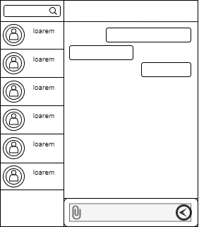
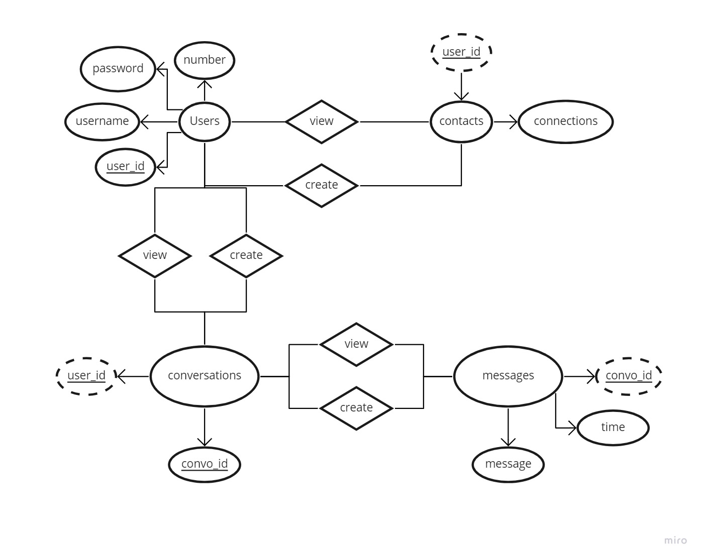

# 401 Final Project

## Team members

1. Mhd Hadi Aji
2. Mohammed Fadi Hboubati
3. Rania Abdullah
4. Sally Ammous

[Team Agreement](team-agreement.md)

## Project Summary

**Communication Application - WhatsApp Replacement:**

1. **Summary:** A communication application that will allow users to send and receive messages
2. **Problem:** In light of WhatsApp's new privacy policy, there is a pull towards new communication applications, so we decided to join this wave and create a new communication application.
3. **MVP:** The ability to create accounts, and send messages to other users.

[Project Requirements](requirements.md)

[Work Flow Plan](https://trello.com/b/Gy3zcQjz/work-plan)

## Wireframe

## Domain Modeling

